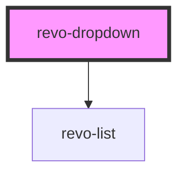

# RevoDropdown component

<p align="center">
  <a href="https://github.com/revolist/revodropdown/blob/master/LICENSE"></a>
</p>

<i>Autocomplete</i>


<br>
<i>Regular select</i>

<br>
# Description

This is minimalistic dropdown webcomponent. 
After long search we couldn't find any cross platform and had to build our own inspired by the latest trends.

## Getting Started

To start building a new web component using Stencil, clone this repo to a new directory:

```bash
git clone https://github.com/revolist/revodropdown.git revo-dropdown
cd revo-dropdown
git remote rm origin
```

and run:

```bash
npm install
npm start
```

To build the component for production, run:

```bash
npm run build
```

To run the unit tests for the components, run:

```bash
npm test
```

Need help? Check out docs [here](https://stenciljs.com/docs/my-first-component).


### Script tag

- Put a script tag similar to this `<script src='https://unpkg.com/revo-dropdown@latest/dist/revo-dropdown.js'></script>` in the head of your index.html
- Then you can use the element anywhere in your template, JSX, html etc


# revo-dropdown


<!-- Auto Generated Below -->


## Properties

| Property      | Attribute     | Description                              | Type                    | Default      |
| ------------- | ------------- | ---------------------------------------- | ----------------------- | ------------ |
| `appendTo`    | `append-to`   | Where to append element                  | `"body" \| "current"`   | `'body'`     |
| `autoClose`   | `auto-close`  | Should dropdown autoclose on changeValue | `boolean`               | `true`       |
| `dataId`      | `data-id`     | Define object mapping for id/value       | `string`                | `undefined`  |
| `dataLabel`   | `data-label`  | Define object mapping for labels         | `string`                | `undefined`  |
| `filter`      | `filter`      | Filter criteria                          | `"contains" \| "start"` | `'contains'` |
| `hasFilter`   | `has-filter`  |                                          | `boolean`               | `true`       |
| `placeholder` | `placeholder` | Placeholder text                         | `string`                | `'Select'`   |
| `source`      | --            | Define object mapping for id/value       | `any[]`                 | `undefined`  |
| `value`       | `value`       | Selected value                           | `any`                   | `undefined`  |


## Events

| Event         | Description                            | Type                                                     |
| ------------- | -------------------------------------- | -------------------------------------------------------- |
| `changeValue` | When value changed                     | `CustomEvent<{ val: any; originalEvent?: MouseEvent; }>` |
| `close`       | Before element close, can be prevented | `CustomEvent<any>`                                       |
| `open`        | Before element open, can be prevented  | `CustomEvent<any>`                                       |


## Methods

### `doChange(val: any, originalEvent?: MouseEvent) => Promise<void>`

Change value

#### Returns

Type: `Promise<void>`


### `doClose() => Promise<void>`

Close dropdown

#### Returns

Type: `Promise<void>`


### `doOpen() => Promise<void>`

Open dropdown

#### Returns

Type: `Promise<void>`


## Dependencies

### Depends on

- [revo-list](../list)

### Graph


----------------------------------------------

*Built with [StencilJS](https://stenciljs.com/)*
