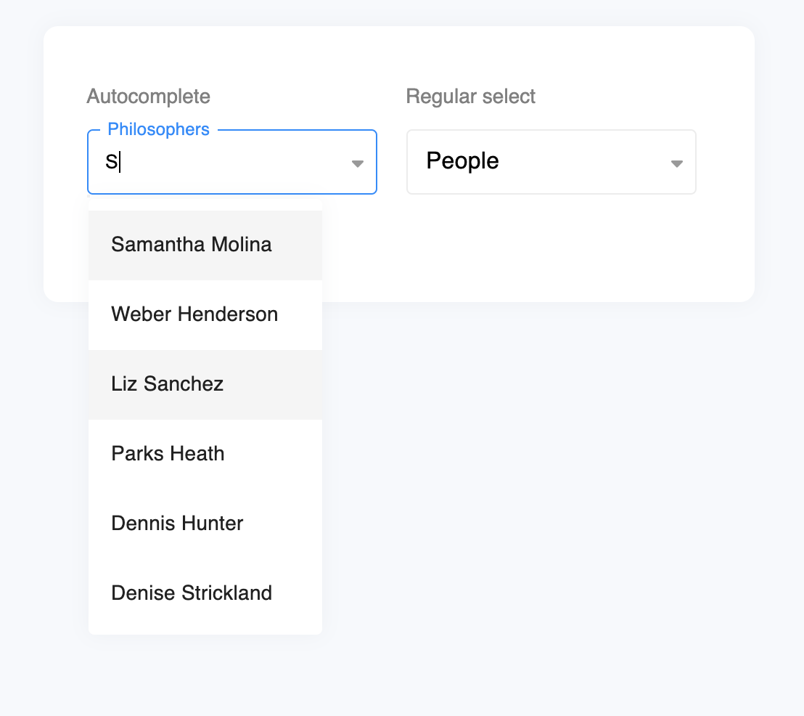
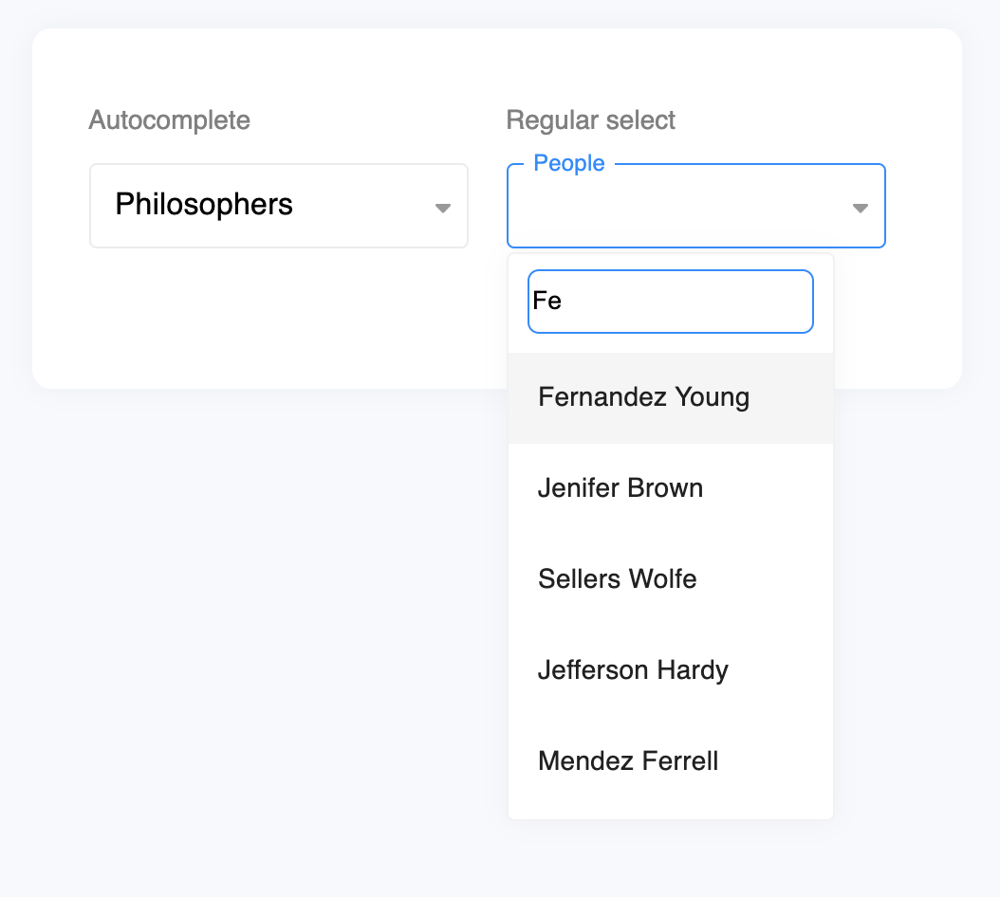
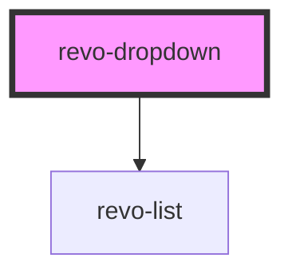

# `revo-dropdown`

Minimalistic dropdown webcomponent.
After long search we couldn't find any cross platform and had to build our own inspired by the latest trends.

| <p align="left">Autocomplete</p>                                                 | <p align="left">Regular select</p>                                     |
| -------------------------------------------------------------------------------- | ---------------------------------------------------------------------- |
|  |  |

## Getting Started

To start building a new web component using Stencil, clone this repo to a new directory:

```bash
npm i @revolist/revo-dropdown
```


### Module import
```js

import * as loader from '@revolist/revo-dropdown/loader';
if (loader.defineCustomElements) {
  loader.defineCustomElements();
}
```


### Script tag

- Put a script tag similar to this `<script src='https://unpkg.com/revo-dropdown@latest/dist/revo-dropdown.js'></script>` in the head of your index.html

### Usage

Then you can use the element anywhere in your template, JSX, html etc


```html
<revo-dropdown data-label="name" autocomplete="true" placeholder="Philosophers" max-height="300"></revo-dropdown>
```

```js
<script type="module">
  const people = [
  {
    eyeColor: 'green',
    name: 'Samantha Molina',
  },
  {
    eyeColor: 'green',
    name: 'Weber Henderson',
  }];
  const dropdowns = document.querySelectorAll('revo-dropdown');
  for (var q = 0; q < dropdowns.length; q++) {
    dropdowns[q].source = people;
  } 
</script>
```

Need help? Check out docs [here](https://stenciljs.com/docs/my-first-component).


# API

<!-- Auto Generated Below -->

## Properties

| Property      | Attribute     | Description                              | Type                    | Default      |
| ------------- | ------------- | ---------------------------------------- | ----------------------- | ------------ |
| `appendTo`    | `append-to`   | Where to append element                  | `"body" \| "current"`   | `'body'`     |
| `autoClose`   | `auto-close`  | Should dropdown autoclose on changeValue | `boolean`               | `true`       |
| `dataId`      | `data-id`     | Define object mapping for id/value       | `string`                | `undefined`  |
| `dataLabel`   | `data-label`  | Define object mapping for labels         | `string`                | `undefined`  |
| `filter`      | `filter`      | Filter criteria                          | `"contains" \| "start"` | `'contains'` |
| `hasFilter`   | `has-filter`  |                                          | `boolean`               | `true`       |
| `placeholder` | `placeholder` | Placeholder text                         | `string`                | `'Select'`   |
| `source`      | --            | Define object mapping for id/value       | `any[]`                 | `undefined`  |
| `value`       | `value`       | Selected value                           | `any`                   | `undefined`  |

## Events

| Event         | Description                            | Type                                                     |
| ------------- | -------------------------------------- | -------------------------------------------------------- |
| `changeValue` | When value changed                     | `CustomEvent<{ val: any; originalEvent?: MouseEvent; }>` |
| `close`       | Before element close, can be prevented | `CustomEvent<any>`                                       |
| `open`        | Before element open, can be prevented  | `CustomEvent<any>`                                       |

## Methods

### `doChange(val: any, originalEvent?: MouseEvent) => Promise<void>`

Change value

#### Returns

Type: `Promise<void>`

### `doClose() => Promise<void>`

Close dropdown

#### Returns

Type: `Promise<void>`

### `doOpen() => Promise<void>`

Open dropdown

#### Returns

Type: `Promise<void>`

## Dependencies

### Depends on

- [revo-list](../list)

### Graph



---

_Built with [StencilJS](https://stenciljs.com/)_
