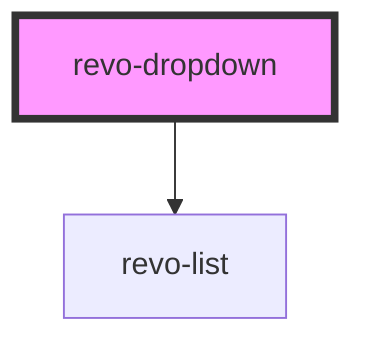

# revo-dropdown

<!-- Auto Generated Below -->

## Properties

| Property        | Attribute        | Description                              | Type                                | Default     |
| --------------- | ---------------- | ---------------------------------------- | ----------------------------------- | ----------- |
| `appendTo`      | `append-to`      | Where to append element                  | `"body" \| "current"`               | `'body'`    |
| `autoClose`     | `auto-close`     | Should dropdown autoclose on changeValue | `boolean`                           | `true`      |
| `autoFocus`     | `auto-focus`     |                                          | `boolean`                           | `false`     |
| `autocomplete`  | `autocomplete`   |                                          | `boolean`                           | `false`     |
| `currentFilter` | `current-filter` | Filter value                             | `any`                               | `undefined` |
| `dataId`        | `data-id`        | Define object mapping for id/value       | `string`                            | `undefined` |
| `dataLabel`     | `data-label`     | Define object mapping for labels         | `string`                            | `undefined` |
| `filter`        | `filter`         | Filter criteria                          | `"contains" \| "start"`             | `undefined` |
| `hasFilter`     | `has-filter`     |                                          | `boolean`                           | `true`      |
| `maxHeight`     | `max-height`     |                                          | `number`                            | `undefined` |
| `placeholder`   | `placeholder`    | Placeholder text                         | `string`                            | `'Select'`  |
| `source`        | --               | Define object mapping for id/value       | `any[]`                             | `[]`        |
| `template`      | --               |                                          | `(h: Function, item: any) => VNode` | `undefined` |
| `value`         | `value`          | Selected value                           | `any`                               | `undefined` |

## Events

| Event     | Description                            | Type                                                     |
| --------- | -------------------------------------- | -------------------------------------------------------- |
| `changed` | When value changed                     | `CustomEvent<{ val: any; originalEvent?: MouseEvent; }>` |
| `close`   | Before element close, can be prevented | `CustomEvent<any>`                                       |
| `open`    | Before element open, can be prevented  | `CustomEvent<any>`                                       |

## Methods

### `doChange(val: any, originalEvent?: MouseEvent) => Promise<void>`

Change value

#### Parameters

| Name            | Type         | Description |
| --------------- | ------------ | ----------- |
| `val`           | `any`        |             |
| `originalEvent` | `MouseEvent` |             |

#### Returns

Type: `Promise<void>`

### `doClose(isDisconnected?: boolean) => Promise<void>`

Close dropdown

#### Parameters

| Name             | Type      | Description |
| ---------------- | --------- | ----------- |
| `isDisconnected` | `boolean` |             |

#### Returns

Type: `Promise<void>`

### `doOpen() => Promise<void>`

Open dropdown

#### Returns

Type: `Promise<void>`

## Dependencies

### Depends on

- [revo-list](../list)

### Graph

----------------------------------------------

*Built with [StencilJS](https://stenciljs.com/)*
