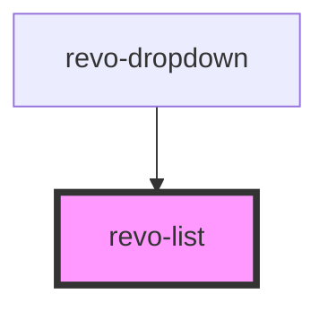

# revo-list

<!-- Auto Generated Below -->

## Properties

| Property    | Attribute    | Description                        | Type                    | Default      |
| ----------- | ------------ | ---------------------------------- | ----------------------- | ------------ |
| `dataLabel` | `data-label` | Define object mapping for labels   | `string`                | `undefined`  |
| `filter`    | `filter`     | Filter criteria                    | `"contains" \| "start"` | `'contains'` |
| `source`    | --           | Define object mapping for id/value | `any[]`                 | `[]`         |

## Events

| Event      | Description | Type                                         |
| ---------- | ----------- | -------------------------------------------- |
| `doChange` |             | `CustomEvent<{ item: any; e: MouseEvent; }>` |

## Methods

### `doFilter(val: string) => Promise<void>`

#### Returns

Type: `Promise<void>`

## Dependencies

### Used by

 - [revo-dropdown](../main)

### Graph

----------------------------------------------

*Built with [StencilJS](https://stenciljs.com/)*
