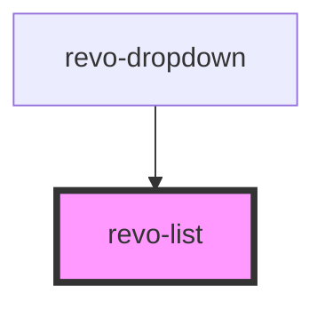

# revo-list

<!-- Auto Generated Below -->

## Properties

| Property                | Attribute        | Description                        | Type                   | Default     |
| ----------------------- | ---------------- | ---------------------------------- | ---------------------- | ----------- |
| `isFocused`             | `is-focused`     |                                    | `boolean`              | `false`     |
| `selectedIndex`         | `selected-index` | Selected Value Index               | `number`               | `0`         |
| `sourceItems`           | --               | Define object mapping for id/value | `any[]`                | `[]`        |
| `template` _(required)_ | --               |                                    | `(item: any) => VNode` | `undefined` |

## Events

| Event     | Description | Type                                  |
| --------- | ----------- | ------------------------------------- |
| `changed` |             | `CustomEvent<{ item: any; e: any; }>` |

## Methods

### `refresh(source: any[]) => Promise<void>`

#### Parameters

| Name     | Type    | Description |
| -------- | ------- | ----------- |
| `source` | `any[]` |             |

#### Returns

Type: `Promise<void>`

## Dependencies

### Used by

 - [revo-dropdown](../dropdown)

### Graph

----------------------------------------------

*Built with [StencilJS](https://stenciljs.com/)*
